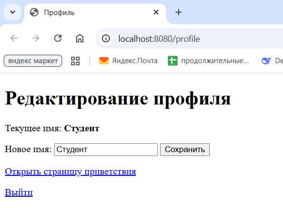
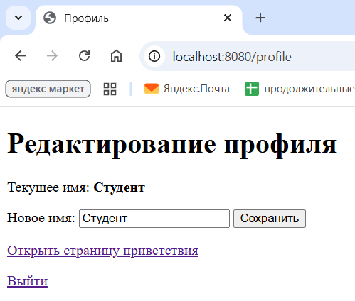

# PZ6: Реализация защиты от CSRF/XSS. Работа с secure cookies

Студент: Анастасиади Д.Е. Группа: ПИМО-01-25

## Архитектура

- **Web Application**: Приложение запускает HTTP-сервер на порту 8080 с маршрутами для имитации авторизации, редактирования профиля и отображения приветствия.
- **Session Management**: Используется in-memory хранилище для пользовательских профилей с сессионными ID и CSRF-токенами.
- **Security Features**: Реализованы secure cookies (HttpOnly, SameSite), CSRF-защита через токены, безопасный вывод HTML через шаблоны для предотвращения XSS.
- **Logout**: Добавлен маршрут для выхода, очищающий сессионную cookie.

## Структура проекта

```
pz6-web-security/
├── cmd/server/main.go
├── internal/auth/cookie.go
├── internal/auth/csrf.go
├── internal/httpapi/handler.go
├── internal/store/store.go
├── templates/profile.html
├── templates/hello.html
├── go.mod
└── README.md
```

## Установка зависимостей

```powershell
go mod tidy
```

## Запуск сервиса

```powershell
cd pz6-web-security
go run ./cmd/server
```

Ожидаемый вывод:

```
server started on http://localhost:8080
open http://localhost:8080/login
```


## Быстрая проверка работоспособности

### 1. Переход на /login

Откройте в браузере http://localhost:8080/login. Приложение создаст сессию, установит cookie session_id и перенаправит на /profile.

### 2. Отображение формы профиля

На странице /profile отображается форма с текущим именем "Студент" и скрытым CSRF-токеном.



### 3. Изменение имени

Введите новое имя, например "Иван", и нажмите "Сохранить". Сервер проверит CSRF-токен и перенаправит на /hello.


### 4. Страница приветствия

Отобразится "Здравствуйте, Иван!" с безопасным выводом через шаблон.


### 5. Проверка CSRF-защиты

Пробуем отправить POST /profile без csrf_token или с неверным токеном (например, через Postman). Сервер вернёт 403 Forbidden "invalid csrf token".

```
curl.exe -i -X POST "http://localhost:8080/profile" -H "Cookie: session_id=cc8b792ea6face97cf97f3c92640f9fe" -d "name=Тест"
```


### 6. Проверка XSS-защиты

Введём в имя `<script>alert('xss')</script>`. На странице /hello отобразится текст без выполнения скрипта.


### 7. Logout

Нажмите "Выйти" на любой странице. Cookie будет очищена, и произойдёт перенаправление на /login и потом на /profile



## Описание реализации

- `cmd/server/main.go`: Запускает сервер на порту 8080, регистрирует маршруты /login, /profile, /hello, /logout.
- `internal/store/store.go`: In-memory хранилище для пользовательских профилей с методами Save, Get, UpdateName.
- `internal/auth/csrf.go`: Функция RandomToken для генерации случайных токенов.
- `internal/auth/cookie.go`: Функции SetSessionCookie (с HttpOnly, SameSiteLaxMode) и ReadSessionCookie.
- `internal/httpapi/handler.go`: Обработчики Login (создаёт сессию), Profile (GET - форма, POST - обновление с проверкой CSRF), Hello (безопасный вывод), Logout (очищает cookie).
- `templates/profile.html`: HTML-шаблон формы с CSRF-токеном.
- `templates/hello.html`: Шаблон приветствия с безопасным выводом имени.

## Дополнительное задание №1

Реализован маршрут GET /logout, который очищает сессионную cookie (MaxAge: -1) и перенаправляет на /login. Ссылки на logout добавлены в шаблоны profile.html и hello.html.

## Фрагменты кода

### Установка cookie

```go
func SetSessionCookie(w http.ResponseWriter, value string) {
    http.SetCookie(w, &http.Cookie{
        Name:     SessionCookieName,
        Value:    value,
        Path:     "/",
        HttpOnly: true,
        Secure:   false,
        SameSite: http.SameSiteLaxMode,
        MaxAge:   3600,
    })
}
```

### Генерация CSRF-токена

```go
func RandomToken(size int) (string, error) {
    buf := make([]byte, size)
    if _, err := rand.Read(buf); err != nil {
        return "", err
    }
    return hex.EncodeToString(buf), nil
}
```

### Проверка CSRF-токена

```go
if err := r.ParseForm(); err != nil {
    http.Error(w, "bad form", http.StatusBadRequest)
    return
}

tokenFromForm := r.FormValue("csrf_token")
if tokenFromForm == "" || tokenFromForm != profile.CSRFToken {
    http.Error(w, "invalid csrf token", http.StatusForbidden)
    return
}
```

### Безопасный HTML-шаблон

`templates/hello.html`:

```html
<!DOCTYPE html>
<html lang="ru">
<head>
    <meta charset="UTF-8">
    <title>Приветствие</title>
</head>
<body>
    <h1>Здравствуйте, {{.Name}}!</h1>
    <p>Это безопасный вывод имени пользователя через шаблон.</p>
    <p><a href="/profile">Вернуться к профилю</a></p>
    <p><a href="/logout">Выйти</a></p>
</body>
</html>
```

### Опасный XSS-пример

```go
func unsafeHello(w http.ResponseWriter, name string) {
    html := "<html><body><h1>Здравствуйте, " + name + "!</h1></body></html>"
    w.Header().Set("Content-Type", "text/html; charset=utf-8")
    _, _ = w.Write([]byte(html))
}
```

Этот подход небезопасен, потому что `name` может содержать `<script>` и браузер выполнит его как код.

## Результаты проверки

- Переход на `/login`: приложение создает сессию и устанавливает cookie `session_id`, затем редиректит на `/profile`.
- Отображение формы профиля: на `/profile` видна форма с текущим именем "Студент" и скрытым полем `csrf_token`.
- Успешное изменение имени: отправка формы с `name=Иван` приводит к редиректу на `/hello` и отображению `Здравствуйте, Иван!`.
- Ошибка при неверном CSRF-токене: POST `/profile` без `csrf_token` или с неверным значением возвращает `403 Forbidden` и `invalid csrf token`.
- Безопасное отображение строки со script-тегом: при вводе `<script>alert('xss')</script>` на `/hello` текст отображается как безопасный текст, alert не срабатывает.

## Контрольные вопросы

1. Что такое CSRF?
   - CSRF (Cross-Site Request Forgery) - это атака, при которой злоумышленник заставляет браузер пользователя отправить запрос на целевой сайт без его осознанного намерения, используя уже установленные cookies сессии.

2. Почему наличие cookie не гарантирует, что запрос действительно инициировал пользователь?
   - Потому что браузер автоматически прикладывает cookies к запросам на тот же домен, даже если запрос инициирован с другого сайта (например, через скрытую форму или изображение).

3. Что такое XSS?
   - XSS (Cross-Site Scripting) - это внедрение вредоносного клиентского кода (обычно JavaScript) в веб-страницу, который затем выполняется в браузере пользователя.

4. Чем CSRF отличается от XSS?
   - CSRF использует доверие сервера к cookies браузера, атакуя авторизованные действия. XSS использует доверие браузера к контенту сервера, атакуя отображение данных.

5. Для чего нужен CSRF-токен?
   - CSRF-токен добавляется в формы и проверяется на сервере, чтобы убедиться, что запрос пришёл именно из формы приложения, а не от злоумышленника.

6. Что делает атрибут HttpOnly у cookie?
   - HttpOnly запрещает доступ к cookie из JavaScript в браузере, снижая риск кражи cookie через XSS.

7. Для чего нужен атрибут Secure?
   - Secure указывает браузеру отправлять cookie только по HTTPS, защищая от перехвата в незащищённых соединениях.

8. Какую роль играет SameSite?
   - SameSite ограничивает отправку cookie в межсайтовых запросах, помогая предотвратить CSRF-атаки.

9. Почему нельзя вставлять пользовательский ввод в HTML через конкатенацию строк?
   - Потому что пользовательский ввод может содержать HTML/JavaScript, который будет интерпретирован браузером как код, приводя к XSS.

10. Почему шаблоны безопаснее ручной сборки HTML?
    - Шаблоны автоматически экранируют специальные символы (например, < > &), предотвращая интерпретацию пользовательского ввода как HTML/JS.</content>
<parameter name="filePath">c:\Users\dimma\Desktop\ПИШ\2 СЕМ\Технологии создания ПО\PZ22\pz6-web-security\README.md